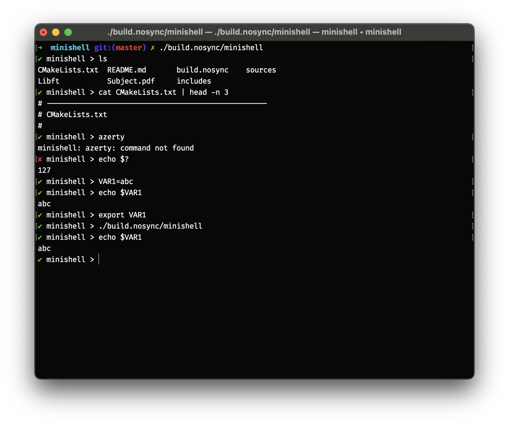
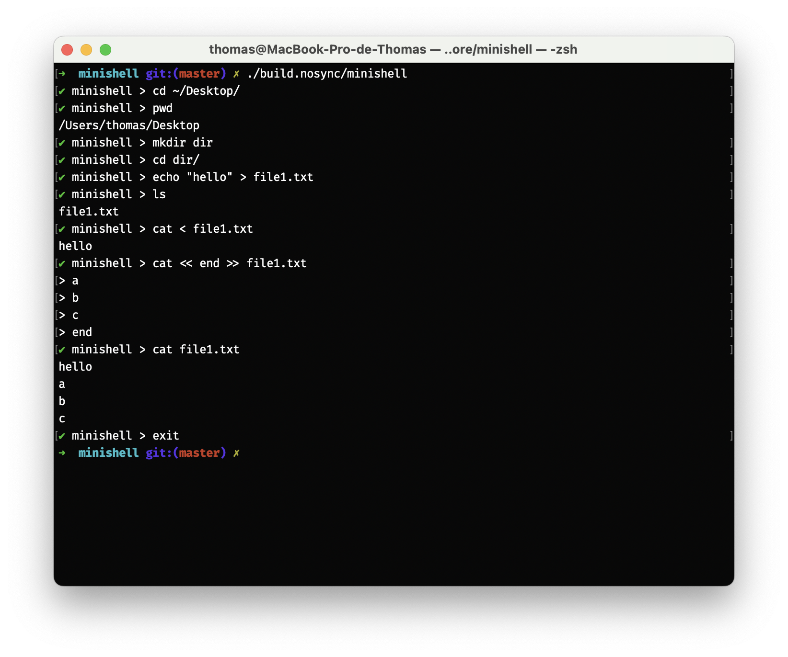

minishell
=========

minishell is a bash-like shell that provides a good subset of bash features. This is the first group project at 42.

For more information about the subject, please refer to [Subject.pdf](Subject.pdf).

Features
--------

minishell is able to:

- Run a program using its absolute path or using the `PATH` environment variable.
- Redirect the input and output of a program using `<`, `>`, or `>>`.
- Use heredoc as input when using `<<`.
- Handle double and single quotes properly to escape special characters like bash or zsh.
- Handle pipes `|` to redirect the standard output of a program to the standard input of the next program.
- Handle environment variables, user-defined ones, or the built-in `$?` to get the return value of the last command.
- Handle `ctrl-C`, `ctrl-D`, and `ctrl-\` properly when no program is running or forward all the signals to the running program.
- And more.

The following commands are built into the shell and may not support all the options and arguments. Refer to [Subject.pdf](Subject.pdf) for more information:

- echo
- cd
- pwd
- export
- unset
- env
- exit

Command history and autocompletions are also supported, but this is done automatically by readline.

Requirements
------------

minishell can only be built on macOS with either clang or gcc.

The readline library is required to build. The version of readline installed on macOS is not enough; it must be installed with Homebrew (`brew install readline`) or any other way.

Build
-----

The project can be built using CMake.

```sh
mkdir build
cmake -S . -B build
cmake --build build
```

For CMake to find the readline library, it must either be in a standard system library directory or the directory must be included in the `LD_LIBRARY_PATH` environment variable. Alternatively, you can pass the path to the library or the directory containing it to CMake during configuration using `MSH_READLINE_DIR` or `MSH_READLINE_PATH`.

Example:

```sh
mkdir build
cmake -S . -B build -DMSH_READLINE_DIR=/usr/local/opt/readline/lib
cmake --build build
```

Usage
-----

After building, minishell can be run directly and used like any shell.

```sh
./build/minishell
```

Examples
--------




Libraries
---------

minishell only uses readline to print a prompt and get the command as a string. readline also provides autocompletion with tab and command history using up and down arrows.
Only a limited set of functions were allowed, including required ones like `pipe` and `fork`, but more advanced functions like `strlcpy` or `strlcat` were not permitted. This is why we utilized the libft library, a collection of utility functions developed during the first project at 42 and continuously improved thereafter.

Learning
--------

minishell was a very interesting project to work on. It allowed me to gain a deep understanding of how a shell works and how interprocess communication is done in a UNIX environment.  
minishell was also a great opportunity to improve my git and GitHub skills as it was a group project. We heavily used GitHub to synchronize our work and manage any bugs we encountered through issues and pull requests.  
Since I focused more on the lexer, parser, and expander parts, that's where I faced the most difficulties.  
Because it is required to implement a lot of functionalities, minishell is a project that could easily go wrong during evaluation. The subject is very vague on the requirements, so everything that is not mentioned must be exactly like bash. This was the most challenging aspect for me. For example, executing the following command:

```sh
✔︎ minishell > ON='o -n'
✔︎ minishell > ech$ON hello
```

should be interpreted as:

```sh
✔︎ minishell > echo -n hello
```

where a naive way of expanding environment variables would interpret it as:

```sh
✔︎ minishell > 'echo -n' hello
```

This becomes even more complicated considering that bash throws parsing errors before expansion errors. So, executing the command:

```sh
✔︎ minishell > | echo ${.}
```

should throw a parsing error and not a bad substitution error.  
To handle these cases, I ended up doing 2 passes on the lexer, one on the command string and one on the expanded token after substituting the variables. So, the whole workflow looks something like this:

```txt
lexer -> parser -> expander -> lexer -> AST -> execution
```

In conclusion, minishell was one of my favorite projects at 42 because of the amount of knowledge I gained about shells, git, GitHub, and collaborative work in software development.
